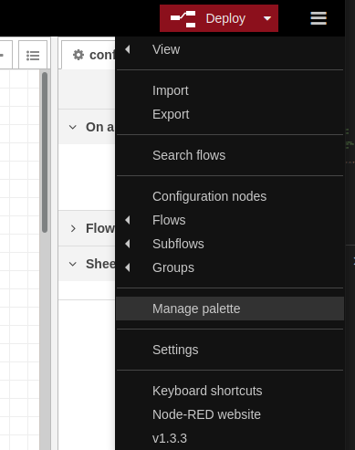
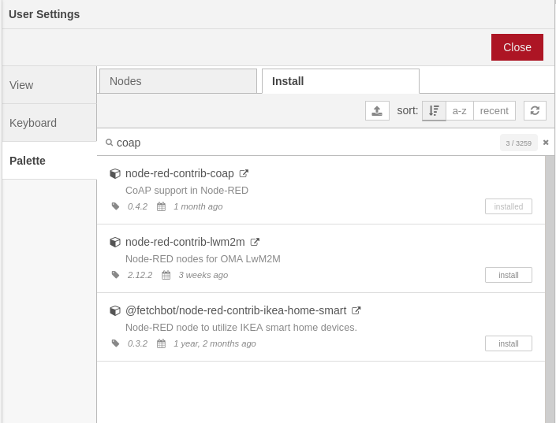
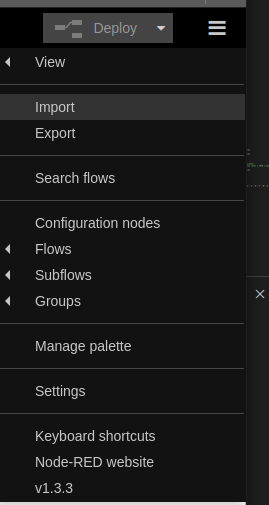
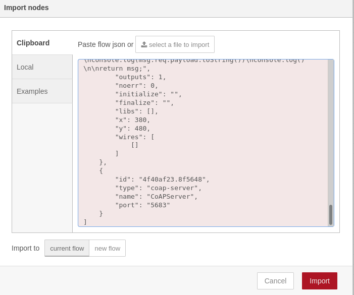
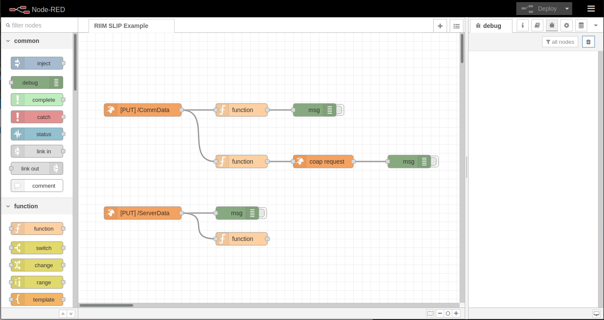

System Setup
============

Linux Machine Setup
-------------------

*Note:* Running the **./Tools/Setup.sh** script helps you install all prerquisites and set up the Edge Computer

Mandatory Prerequisites
-----------------------

radvd
+++++
radvd is a tool for routing IPv6 traffic. It can be installed like this

.. code-block::

    sudo apt install radvd | fdsfds

python3
+++++++
Python is an interpreted programming language. It can be installed like this

.. code-block::

    sudo apt install python3

Python packages
+++++++++++++++
Python needs a few packages that are used by the tools provided. These can be installed like this

.. code-block::

    pip3 install --user pycryptodomex pyserial

node-red
++++++++
Node Red is a programming tool for connecting hardware, services and APIs. It can either be installed using the package manager like this (Not recommended, but easier):

.. code-block::

    sudo apt install Node-RED

Or it can be installed using the install script on the official page `<https://nodered.org/docs/getting-started/raspberrypi>`_ (Recommended, but a little harder)

Optional Prerequisites
----------------------

wireshark
+++++++++
Wireshark is a tool for anayzing network traffic. It is useful for analyzing and debugging problems related to network traffic. It it can be installed like this

.. code-block::

    sudo apt install wireshark

microcom
++++++++
Microcom is a simple terminal program that can be used for interfacing UART based serial interfaces. It can be installed like this

.. code-block::

    sudo apt install microcom

Network Setup
-------------

In general network setup on this level can be complicated. Radiocrafts provide a setup script that sets up all the essentials for the example to work, and leaves out the unneccesary bits. In combination with the Node Red server, this should be sufficient for your application to connect to whatever online server you are using.

The script uses a precompiled SLIP/TUN driver. This driver is responsible for connecting to the UART and map it to a virtual network device (TUN). This TUN device can in turn be used like most other network devices.

Node RED Setup
--------------
After all other setup is done, it is time to setup Node RED. To access Node RED, it must have been started. That can be achieved by executing **./Tools/Start.sh** which will start it automatically.

After startup, Node RED will be accesible through a browser. If you are running the browser locally (on the edge computer), the address will be `<http://localhost:1880/>`_ . If accessing from the outside, change **localhost** with the IP address of the edge computer. If unsure how to get it, see the troubleshooting section.

We need to install a CoAP extension to Node RED and import our flow. Start by clicking the menu in the top right corner and select **Manage palette** . Click the **Install** tab and type "coap" in the search bar. Select to install **node-red-contrib-coap**. Node RED is now set up with support for CoAP.

Now we need our flow. Open the menu again and select **Import**. Import the file located in ./NodeRed/RIIM_SLIP_Example_NodeRed.json.

All is now set up. To start the Node RED server, click the big red **Deploy** button in the top right corner.

